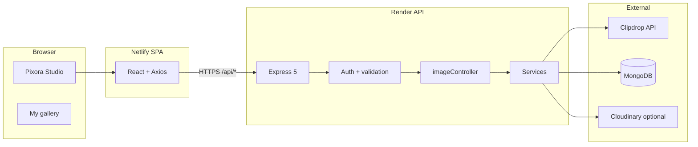
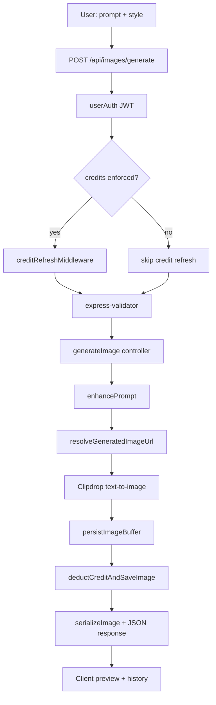
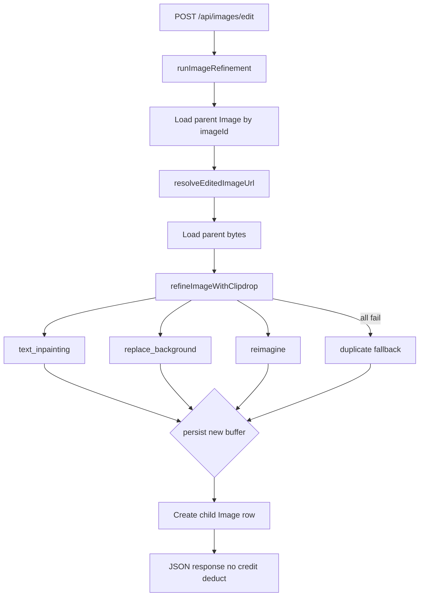
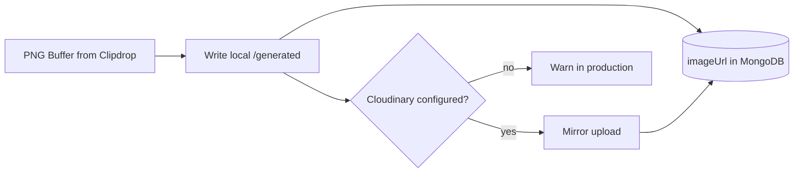
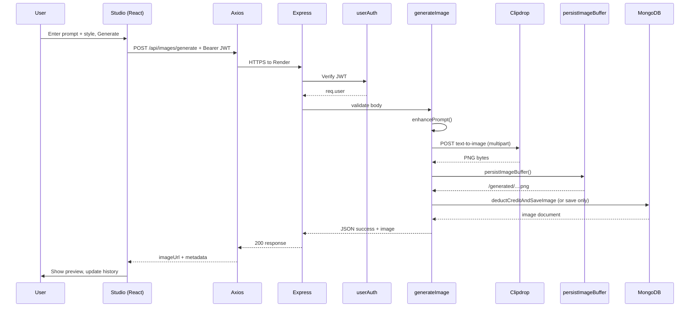
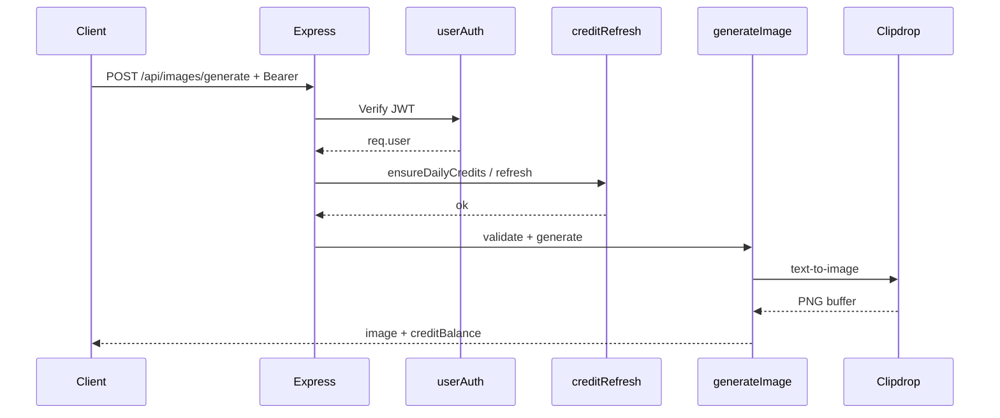
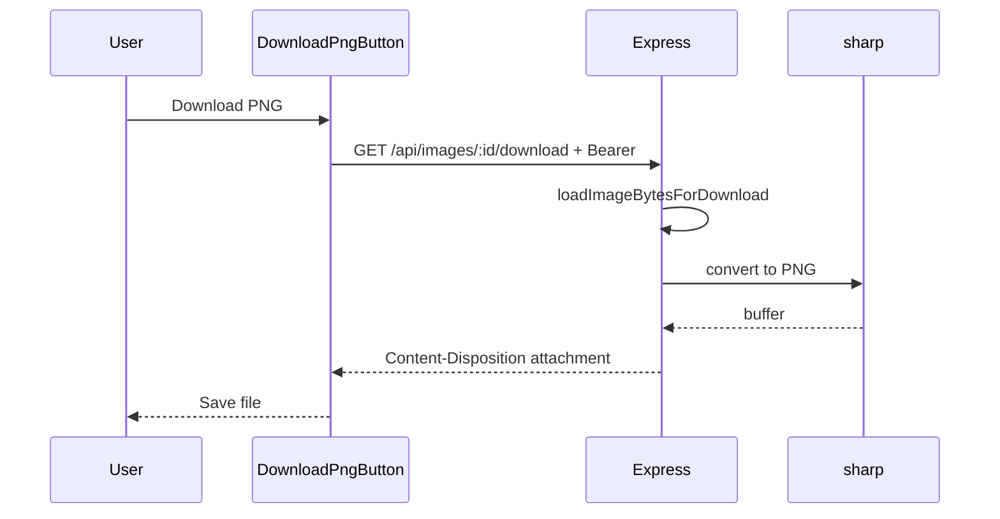

# Generation pipeline and API orchestration

This document describes how **Pixorify** turns a user prompt in **Pixora Studio** into a stored image—and how the React client, Express API, Clipdrop, MongoDB, and file storage work together.

**Related files:** `docs/PROJECT_REFERENCE.md` (repo-wide index) · `docs/DESIGN_SYSTEM_AND_ASSETS.md` (colors, `photos/` inventory) · `server/.env.example` · `client/src/config/api.js` · `netlify.toml`

**Product note (current):** The live UI focuses on **sign in → generate → download → like**. **Credits** and **Refine** are disabled in the UI but remain in the codebase behind feature flags. This doc covers both the **active** path and the **dormant** refine/credit paths so re-enabling them is predictable.

---

## Table of contents

1. [Architecture overview](#architecture-overview)
2. [Deployment topology](#deployment-topology)
3. [Client API orchestration](#client-api-orchestration)
4. [Generation pipeline (text-to-image)](#generation-pipeline-text-to-image)
5. [Refinement pipeline (image-to-image)](#refinement-pipeline-image-to-image)
6. [Supporting API endpoints](#supporting-api-endpoints)
7. [Middleware and cross-cutting concerns](#middleware-and-cross-cutting-concerns)
8. [Data model (Image document)](#data-model-image-document)
9. [Storage orchestration](#storage-orchestration)
10. [Environment variables](#environment-variables)
11. [Sequence diagrams](#sequence-diagrams)
12. [Source file index](#source-file-index)

---

## Architecture overview

Pixorify is a **split deploy**: the marketing/workspace UI runs as a static SPA; the API runs on a separate host. Generation always flows **browser → Express → Clipdrop → persist → MongoDB → JSON back to browser**.

### High-level component diagram



### Responsibility matrix

| Layer | Typical host | Technology | Responsibility |
|-------|----------------|------------|----------------|
| **SPA** | Netlify | React 19, Vite 7 | UI: Studio compose, gallery, auth modal, downloads |
| **API** | Render | Express 5 | JWT auth, validation, orchestration, rate limits |
| **AI provider** | Clipdrop (SaaS) | REST multipart | Text-to-image; image-to-image for refine |
| **Database** | MongoDB Atlas | Mongoose | Users, image metadata, credits, feedback |
| **Object storage** | Render disk + optional Cloudinary | FS / Cloudinary SDK | PNG bytes; DB stores URL paths only |

### End-to-end generation (one sentence)

The user submits a prompt and style in Studio → the client `POST`s to `/api/images/generate` with a JWT → the server enhances the prompt, calls Clipdrop text-to-image, saves the PNG, writes an `Image` row (and optionally deducts credits) → the client displays the image using `resolveImageUrl()`.

---

## Deployment topology

### Local development vs production

| Aspect | Local (`npm run dev`) | Production (Netlify + Render) |
|--------|------------------------|-------------------------------|
| **Frontend** | `http://localhost:5173` (Vite) | `https://<site>.netlify.app` |
| **API base URL** | Same-origin (`""`); Vite **proxies** `/api` and `/generated` to port 4000 | Absolute origin: `VITE_BACKEND_URL` baked at build (see `netlify.toml`, `client/.env.production`) |
| **CORS** | Not needed (proxy) | Render must allow Netlify origin (see `server/server.js`) |
| **Clipdrop** | `CLIPDROP_API` in `server/.env` | Same on Render |
| **Images** | `server/public/generated/` | Local path + Cloudinary mirror when configured |

### API base URL resolution (client)

Order of precedence in `client/src/config/api.js`:

| Priority | Source | Purpose |
|----------|--------|---------|
| 1 | `localStorage.pixora_api_base` | Manual override (debug) |
| 2 | `globalThis.__PIXORA_API_BASE__` | From `<meta name="pixora-api-base">` or `/pixora-runtime.js` |
| 3 | `import.meta.env.VITE_BACKEND_URL` | Vite build-time env |
| 4 | `DEFAULT_BACKEND_ORIGIN` in `client/src/config/backendOrigin.js` | Fallback when on a non-localhost host in production builds |

**Development:** `getRequestBaseUrl()` returns `""` on `localhost` / `127.0.0.1` so Axios hits the Vite proxy (`client/vite.config.js` → `VITE_PROXY_TARGET` or `http://localhost:4000`).

**Production:** Requests go to Render, e.g. `https://pixora-backend-p5vv.onrender.com/api/images/generate`.

Build injects the meta tag via the `pixora-inject-backend-meta` Vite plugin (`client/vite.config.js`).

---

## Client API orchestration

### Global HTTP client (`client/src/context/AppContext.jsx`)

| Concern | Implementation |
|---------|----------------|
| HTTP library | Axios single instance |
| `baseURL` | Set per request from `getRequestBaseUrl()` |
| Authentication | `Authorization: Bearer <token>` from `localStorage` |
| Session end | 401 on protected routes → logout + login modal |
| Gallery history | `fetchHistory()` → `GET /api/images/history` |
| Credits polling | Only when `VITE_CREDITS_UI_ENABLED=true` → `/api/user/credits` or `/api/user/me` |

### Studio generate flow (`client/src/pages/Studio.jsx`)

| Step | Action |
|------|--------|
| 1 | User enters prompt, picks style, clicks **Generate** |
| 2 | Client validates non-empty prompt and sign-in |
| 3 | `POST /api/images/generate` with body: `{ prompt, style, isPublic: false }` |
| 4 | On success: `resolveImageUrl()` for preview; update `generatedImage` and `history` |
| 5 | Optional: `fetchUserData()` if credits UI enabled |
| 6 | **Download:** `DownloadPngButton` → `client/src/lib/downloadImage.js` → `GET /api/images/:imageId/download` |

**Refine (UI):** Buttons link to `/coming-soon?feature=refine`; the server refine routes still exist but are not called from the current Studio UI.

### Download orchestration (`client/src/lib/downloadImage.js`)

| Strategy | When used |
|----------|-----------|
| `fetch` + blob | Same-origin or CORS-allowed API; reads PNG bytes |
| Hidden iframe | Cross-origin attachment download without reading response body |
| Path fallbacks | Tries `/api/images/download/:id` and `/api/images/:id/download` |

Server normalizes to PNG via Sharp before `Content-Disposition: attachment`.

---

## Generation pipeline (text-to-image)

This is the **primary** path used in production today.

### Pipeline overview diagram



### Step 1 — HTTP entry

| Item | Detail |
|------|--------|
| **Canonical route** | `POST /api/images/generate` |
| **Aliases** | `POST /api/images/generate-image` (same handler) |
| **Router file** | `server/routes/imageRoutes.js` |
| **Middleware chain** | `authedCredits` → see below |
| **Body validation** | `prompt` 3–1000 chars; optional `style`, `isPublic`, `tags` (max 8) |
| **Rate limit** | `generationLimiter` (12/min) on `/api/v1/image/*` only—not on main `/api/images` mount |

#### `authedCredits` middleware (`server/middlewares/authedCredits.js`)

| `CREDITS_ENABLED` | Middleware stack |
|-------------------|------------------|
| `false` / unset (current default) | `[userAuth]` only |
| `true` | `[userAuth, creditRefreshMiddleware]` |

`userAuth` verifies JWT and sets `req.user`. `creditRefreshMiddleware` runs IST daily credit rollover via `refreshUserCreditsFromDb` when enforcement is on.

### Step 2 — Controller (`server/controllers/imageController.js` → `generateImage`)

| Order | Function / action | Module |
|-------|-------------------|--------|
| 1 | Reject `isRefinement` on generate body | `generateImage` |
| 2 | `enhancePrompt(prompt, style)` | `server/utils/promptStyles.js` |
| 3 | `resolveGeneratedImageUrl({ prompt, promptEnhanced })` | `server/services/imageService.js` |
| 4 | `deductCreditAndSaveImage({ ... imageUrl, provider: "clipdrop" })` | `server/services/creditService.js` |
| 5 | `serializeImage(image, req)` | `server/utils/imageUrl.js` |
| 6 | Return JSON with `image`, `creditBalance`, `credits`, `remainingCredits` | — |

### Step 3 — Prompt enhancement (no external AI)

`enhancePrompt` **does not** call another model. It normalizes whitespace and appends a fixed style hint:

```js
// server/utils/promptStyles.js (conceptual)
`${cleanPrompt}. Style: ${PROMPT_STYLES[style]}`
```

| Style key | Appended hint (summary) |
|-----------|---------------------------|
| `realistic` | Ultra realistic lighting, cinematic look |
| `anime` | Anime, vibrant, cel-shaded |
| `cyberpunk` | Neon, futuristic city |
| `fantasy` | Epic fantasy concept art |
| `minimal` | Minimal clean composition |

### Step 4 — Clipdrop text-to-image (`server/services/imageService.js`)

| Setting | Value |
|---------|--------|
| **Endpoint** | `https://clipdrop-api.co/text-to-image/v1` |
| **Auth** | Header `x-api-key: CLIPDROP_API` |
| **Request** | `multipart/form-data` with field `prompt` (enhanced text, max 1000 chars) |
| **Response** | `arraybuffer` → Node `Buffer` |
| **Timeout** | 120 seconds |
| **Errors** | `CLIPDROP_NOT_CONFIGURED` (500), `CLIPDROP_ERROR` (502), `CLIPDROP_EMPTY` (502) |

### Step 5 — Persist bytes (`server/services/imageStorageService.js`)

| Step | Action |
|------|--------|
| 1 | Write `server/public/generated/<timestamp>-<random>.png` |
| 2 | Return relative URL `/generated/<filename>.png` |
| 3 | If Cloudinary configured → mirror upload (failure logged; local URL still returned) |
| 4 | If production without Cloudinary → warn: Render disk is ephemeral |

The MongoDB `Image` document stores **only the URL string**, not binary data.

### Step 6 — Credits and database (`server/services/creditService.js`)

#### When credits are disabled (current default)

| Action | Behavior |
|--------|----------|
| Transaction | Mongo session still used |
| Deduction | **Skipped** — `saveImageWithoutCreditDeduction` |
| `Image` doc | `generationKind: "generate"`, `version: 1`, `threadRootId` set to own `_id` |
| Response | `remainingCredits` = user's snapped balance (unchanged) |

#### When `CREDITS_ENABLED=true`

| Action | Behavior |
|--------|----------|
| `ensureDailyCredits` | IST midnight refill to daily pool |
| Cost | `getCreditsPerImage()` → **10 credits** per new image |
| Deduction | Atomic `$inc` on `User.credits` inside transaction |
| Failure | `402` `DAILY_LIMIT_REACHED` if balance &lt; cost |

### Step 7 — API response (client consumption)

| Field | Use |
|-------|-----|
| `success` | Boolean gate |
| `image` | Serialized document (`_id`, `imageUrl`, `prompt`, `style`, …) |
| `imageUrl` / `resultImage` | Duplicate convenience fields |
| `creditBalance` / `credits` / `remainingCredits` | Credit UI when enabled |

Client calls `resolveImageUrl(image.imageUrl)` so `/generated/...` becomes `https://<api-host>/generated/...` on split deploys.

---

## Refinement pipeline (image-to-image)

**Status:** Server implementation is **complete**; Studio/Gallery UI currently routes users to **Coming soon** instead of calling these endpoints.

### Refinement overview diagram



### HTTP entry

| Route | Handler | Notes |
|-------|---------|-------|
| `POST /api/images/edit` | `editImage` → `runImageRefinement` | Canonical |
| `POST /api/images/refine` | `refineImage` | Alias; accepts `refinementPrompt` |
| `GET /api/images/thread/:imageId` | `getImageThread` | Version chain for gallery thread UI |

**Body:** `imageId` (MongoId), plus `editPrompt` or `refinementPrompt` (min 3 chars).

### Clipdrop refinement (`server/services/clipdropRefinementService.js`)

Attempts run **in order** until one succeeds:

| Order | Mode | Clipdrop endpoint (summary) |
|-------|------|-----------------------------|
| 1 | `text_inpainting` | Full-frame edit from instruction |
| 2 | `replace_background` | Background replacement |
| 3 | `reimagine` | Stronger visual variation |

Orchestrated by `refineImageWithClipdrop` in `imageEditService.js`. On total failure, **`duplicate_fallback`** copies the parent file to a new URL so the thread does not break.

### Refinement vs generation

| Aspect | Generate | Refine |
|--------|----------|--------|
| Clipdrop API | Text-to-image | Image-to-image (inpainting / background / reimagine) |
| Credits | Deducted when enforced | **Never deducted** |
| `generationKind` | `"generate"` | `"refine"` |
| `parentImageId` | `null` | Parent `_id` |
| `version` | `1` | `parent.version + 1` |

---

## Supporting API endpoints

### User and session

| Method | Path | Purpose |
|--------|------|---------|
| `POST` | `/api/user/register` | Create account → JWT |
| `POST` | `/api/user/login` | Sign in → JWT |
| `GET` | `/api/user/me` | Profile (used when credits UI off) |
| `GET` | `/api/user/credits` | Balance + `nextResetAt` when credits on |

### Images and gallery

| Method | Path | Purpose |
|--------|------|---------|
| `GET` | `/api/images/history` | User's images (alias: `/my-images`) |
| `PATCH` | `/api/images/:imageId/favorite` | Toggle ♥ |
| `DELETE` | `/api/images/:imageId` | Soft delete (`deletedAt`) |
| `GET` | `/api/images/:imageId/download` | PNG attachment download |
| `GET` | `/api/images/gallery/public` | Public gallery (no current client) |
| `POST` | `/api/images/prompt/enhance` | Preview enhanced prompt text only |

### Ops and feedback

| Method | Path | Purpose |
|--------|------|---------|
| `GET` | `/health` | Mongo + Cloudinary status |
| `GET` | `/pixora-runtime.js` | Injects `__PIXORA_API_BASE__` for split deploys |
| `POST` | `/api/feedback` | Help form → `Feedback` collection |

### Mounted API prefixes (`server/server.js`)

| Mount | Router |
|-------|--------|
| `/api/user` | `userRoutes` |
| `/api/auth` | `authRoutes` (deprecated alias) |
| `/api/credits` | `creditRoutes` |
| `/api/images`, `/api/image` | `imageRoutes` |
| `/api/v1/user` | `userRoutes` |
| `/api/v1/image` | `imageRoutes` + rate limiter |
| `/api/feedback` | `feedbackRoutes` |

---

## Middleware and cross-cutting concerns

### CORS (`server/server.js`)

Always allowed:

- `http://localhost:5173`, `127.0.0.1:5173`, preview ports `4173`
- Origins in `ALLOWED_ORIGINS` (comma-separated env)
- `https://*.vercel.app`, `https://*.onrender.com`, `https://*.netlify.app`, `https://*.netlify.live`

Credentials: enabled. Exposed headers include `Content-Disposition` for downloads.

### Other global middleware

| Middleware | Role |
|------------|------|
| `express.json({ limit: "1mb" })` | JSON bodies |
| `helmet` | Security headers |
| `morgan` | Request logging |
| `trust proxy` | Correct client IP behind Render |
| `express.static(/generated)` | Serve local PNGs |
| `errorHandler` | Consistent `{ success, error: { code, message } }` |

### Generation rate limit

| Scope | Limit |
|-------|-------|
| `/api/v1/image/*` | 12 requests per minute per IP |
| `/api/images/generate` (main mount) | No extra limiter on router (only v1 prefix) |

---

## Data model (Image document)

Defined in `server/models/Image.js`. Key fields for pipeline understanding:

| Field | Generate | Refine |
|-------|----------|--------|
| `userId` | Owner | Owner |
| `prompt` / `promptEnhanced` | User text + enhanced | Edit instruction |
| `style` | From request | Copied from parent |
| `imageUrl` | `/generated/...` or Cloudinary | New URL after edit |
| `provider` | `"clipdrop"` | `clipdrop-<mode>` or `*-fallback` |
| `generationKind` | `"generate"` | `"refine"` |
| `parentImageId` | `null` | Parent `_id` |
| `threadRootId` | Self `_id` after create | Root of thread |
| `version` | `1` | `parent.version + 1` |
| `isEdit` | `false` | `true` |
| `isFavorite` | User toggle | User toggle |
| `deletedAt` | Soft delete | Soft delete |

Virtual `promptRaw`: returns `editPrompt` for edits, else `prompt`.

---

## Storage orchestration



| Storage | Path / URL | Durability |
|---------|------------|------------|
| Local disk | `server/public/generated/<file>.png` | Dev reliable; **ephemeral on Render** |
| Cloudinary | Folder `pixorify/generated` | Recommended for production |
| Client display | `resolveImageUrl(stored)` | Rewrites host for Netlify ↔ Render |

`BACKEND_PUBLIC_URL` / `RENDER_EXTERNAL_URL` help build absolute URLs in API responses when the server must advertise its public origin.

---

## Environment variables

### Server (required for generation)

| Variable | Required | Role in pipeline |
|----------|----------|------------------|
| `MONGODB_URI` | Yes | Persist users and images |
| `JWT_SECRET` | Yes | Protect `/api/images/*` |
| `CLIPDROP_API` | Yes (real images) | Clipdrop authentication |
| `CREDITS_ENABLED` | No | When `true`, deduct 10 credits per generate |
| `CLOUDINARY_CLOUD_NAME` etc. | Prod recommended | Durable PNG storage |
| `BACKEND_PUBLIC_URL` | Prod recommended | Correct absolute `imageUrl` in JSON |
| `ALLOWED_ORIGINS` | Optional | Extra CORS origins |
| `PORT` | No (default 4000) | Listen port |

### Client (split deploy)

| Variable | Role |
|----------|------|
| `VITE_BACKEND_URL` | Baked into build; meta tag + `import.meta.env` |
| `VITE_PROXY_TARGET` | Dev proxy target (default `http://localhost:4000`) |
| `VITE_CREDITS_UI_ENABLED` | Show navbar credits when `true` |

See `server/.env.example` and `client/.env.production`. **Never commit** real secrets in `.env` files.

---

## Sequence diagrams

### Full generate request (production)



### Middleware path when credits are enabled



### Download after generate



---

## Source file index

### Client

| File | Role in orchestration |
|------|------------------------|
| `client/src/pages/Studio.jsx` | Triggers `POST /api/images/generate` |
| `client/src/context/AppContext.jsx` | Axios instance, auth header, history fetch |
| `client/src/config/api.js` | API base URL, `resolveImageUrl` |
| `client/src/config/backendOrigin.js` | Production API fallback origin |
| `client/src/lib/downloadImage.js` | Download strategies |
| `client/vite.config.js` | Dev proxy, meta tag injection |
| `netlify.toml` | Netlify build + `VITE_BACKEND_URL` |

### Server

| File | Role in orchestration |
|------|------------------------|
| `server/server.js` | App mount, CORS, static, rate limits |
| `server/routes/imageRoutes.js` | Route definitions + validators |
| `server/controllers/imageController.js` | `generateImage`, download, gallery |
| `server/middlewares/authedCredits.js` | Auth (+ optional credit refresh) |
| `server/middlewares/auth.js` | JWT verification |
| `server/services/imageService.js` | Clipdrop text-to-image |
| `server/services/imageStorageService.js` | Persist buffers |
| `server/services/creditService.js` | Transactional save + credit deduct |
| `server/services/refinementService.js` | Refine orchestration |
| `server/services/imageEditService.js` | Load parent + call Clipdrop edit |
| `server/services/clipdropRefinementService.js` | Clipdrop edit endpoints |
| `server/utils/promptStyles.js` | `enhancePrompt`, style hints |
| `server/config/creditsEnabled.js` | `areCreditsEnforced()` |
| `server/models/Image.js` | Image schema |

---

## Current product vs full codebase

| Capability | User-facing today | Server |
|------------|-------------------|--------|
| Sign in / register | Yes | Yes |
| Text-to-image generate | Yes | Yes |
| Download PNG | Yes | Yes |
| Favorite in gallery | Yes | Yes |
| Daily credits UI | Hidden | Optional via `CREDITS_ENABLED` |
| Refine same image | Coming soon page | `POST /edit` fully implemented |
| Thread / version history | Hidden in gallery UI | `GET /thread/:id` |

---

## Document maintenance

Update this file when you:

- Add or rename image API routes
- Change Clipdrop endpoints or refinement fallback order
- Change credit costs or enforcement flags
- Change deploy hosts (`VITE_BACKEND_URL`, CORS rules)
- Re-enable Refine or credits in the UI

Last aligned with codebase: **main** branch (split Netlify + Render, credits/refine UI off).
